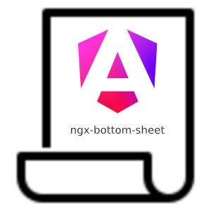

<p align="center" float="left">
     
</p>
<h1 align="center">
Ngx-Bottom-Sheet
</h1>

[](https://ngx-bottom-sheet.arslanameer.com/)
[](https://badge.fury.io/js/ngx-bottom-sheet)
[](https://opensource.org/licenses/MIT)
[]()
[]()


> Ngx-Bottom-Sheet is a highly customizable and lightweight Angular service that provides a mobile-friendly bottom sheet component. Originally designed for Progressive Web Apps (PWA) and mobile-first applications, this component can be used seamlessly in desktop environments as well.


[](https://www.buymeacoffee.com/arslanameer)


## Features

- **Responsive Design**: Automatically adapts to different screen sizes, offering a full-screen experience on mobile and a configurable width on desktop.
- **Customizable Appearance**: Configure width, height, background color, and border radius to match your application's theme.
- **Data Binding**: Pass dynamic data to the bottom sheet component using a flexible data-binding mechanism.
- **Close Button**: Optional close button with customizable appearance.
- **Backdrop Click**: Configurable backdrop click to close functionality.
- **Smooth Animations**: Slide-up animation for an engaging user experience.
- **Multiple Sheets Management**: Supports multiple bottom sheets stacked on top of each other, with automatic tracking of the currently open sheet. Close the topmost sheet or close all sheets with ease.

## DEMO

Visit the [Demo Page](https://ngx-bottom-sheet.arslanameer.com/) to see the bottom sheet in action.

## Supported Angular Versions

| Angular Version | ngx-bottom-sheet Version | Support Status  |
|-----------------|--------------------------|-----------------|
| 16.x            | 1.0.0                    | Supported       |
| 17.x            | 1.0.0                    | Supported       |
| 18.x            | 1.0.0                    | Supported       |


## Installation

Install the package via npm:

```bash
npm install ngx-bottom-sheet
```

## Usage

### Using the Service

Inject the `NgxBottomSheetService` into your component and use it to open the bottom sheet with a custom component:

```typescript
import { Component } from '@angular/core';
import { NgxBottomSheetService } from 'ngx-bottom-sheet';

@Component({
  selector: 'app-root',
  templateUrl: './app.component.html',
})
export class AppComponent {
  constructor(private bottomSheetService: NgxBottomSheetService) {}

  openBottomSheet() {
    this.bottomSheetService.open(MyCustomComponent, {
      height: 'mid',
      showCloseButton: true,
      backgroundColor: 'lightblue',
      data: {
        title: 'Hello World',
        content: 'This is dynamic content!',
      },
    });
  }
}

// Define the component to be displayed in the bottom sheet
@Component({
  selector: 'app-my-custom-component',
  template: `
    <div>
      <h2>{{ bottomSheetData?.title }}</h2>
      <p>{{ bottomSheetData?.content }}</p>
    </div>
  `,
})
export class MyCustomComponent {
  bottomSheetData: any;

  constructor() {}
}
```

### Accessing Passed Data in Bottom Sheet Component

When you open a bottom sheet and pass data using the `data` option, you have two flexible ways to access this data within the bottom sheet component:

#### **Method 1: Using a Property in the Component**

Simply define a property in your component, `bottomSheetData`, and it will automatically be populated with the data passed when the bottom sheet is opened.
>Note: The property name should be `bottomSheetData`

**Example:**

```typescript
@Component({
  selector: 'app-my-custom-component',
  template: `
    <div>
      <h2>{{ bottomSheetData?.title }}</h2>
      <p>{{ bottomSheetData?.content }}</p>
    </div>
  `,
})
export class MyCustomComponent {
  bottomSheetData: any;  // This property will automatically receive the passed data

  constructor() {}
}
```

When you open this component using the `NgxBottomSheetService` and pass data like this:

```typescript
this.bottomSheetService.open(MyCustomComponent, {
  data: {
    title: 'Hello World',
    content: 'This is dynamic content!',
  },
});
```

The `bottomSheetData` property in `MyCustomComponent` will automatically be populated with the object `{ title: 'Hello World', content: 'This is dynamic content!' }`.

#### **Method 2: Using the Bottom Sheet Service**

Another way to access the data is by injecting the `NgxBottomSheetService` into your component and retrieving the data using the `currentSheetData` property.

**Example:**

```typescript
import { Component } from '@angular/core';
import { NgxBottomSheetService } from 'ngx-bottom-sheet';

@Component({
  selector: 'app-my-custom-component',
  template: `
    <div>
      <h2>{{ currentData?.title }}</h2>
      <p>{{ currentData?.content }}</p>
    </div>
  `,
})
export class MyCustomComponent {
  currentData: any;

  constructor(private bottomSheetService: NgxBottomSheetService) {
    this.currentData = this.bottomSheetService.currentSheetData;
  }
}
```

Here, `this.bottomSheetService.currentSheetData` will hold the same data object passed during the bottom sheet's opening. This method is useful if you want more control over how and when you access the data within the component.

### Handling Close Events with `afterClosed$`

The `open` method of `NgxBottomSheetService` returns an object with an `afterClosed$` observable, which you can subscribe to in order to handle any actions after the bottom sheet has been closed.

#### **Example:**

```typescript
const bottomSheetRef = this.bottomSheetService.open(MyCustomComponent, {
  data: {
    title: 'Confirmation',
    message: 'Are you sure you want to proceed?',
  },
});

bottomSheetRef.afterClosed$.subscribe((result) => {
  if (result) {
    console.log('User confirmed:', result);
  } else {
    console.log('User dismissed the bottom sheet.');
  }
});
```

This example shows how to handle the result from the bottom sheet. You can pass a result from the bottom sheet when closing it by using the `close` method:

```typescript
this.bottomSheetService.close({ confirmed: true });
```

In the above scenario, the `result` in the `afterClosed$` subscription will be `{ confirmed: true }`.

### Managing Multiple Bottom Sheets

The `NgxBottomSheetService` is designed to handle multiple bottom sheets being opened simultaneously. It automatically tracks which sheet is currently on top, ensuring that interactions only affect the topmost sheet.

#### **Key Points:**

- **Opening Multiple Sheets:** Each call to `open` will add a new bottom sheet on top of the current one.
- **Closing the Topmost Bottom Sheet:** The `close` method closes the topmost sheet.
  
  ```typescript
  this.bottomSheetService.close();
  ```

- **Closing All Bottom Sheets:** The `closeAll` method will close all open bottom sheets in the order they were opened.
  
  ```typescript
  this.bottomSheetService.closeAll();
  ```

This feature is particularly useful in complex applications where users might interact with multiple stacked bottom sheets. The service handles the z-index and other necessary DOM adjustments automatically, providing a smooth user experience.

### Configuration Options

The `open` method of the `NgxBottomSheetService` accepts a configuration object with the following properties:

- **data**: Custom data to pass to the bottom sheet component.
- **width**: The width of the bottom sheet. Can be `'small'`, `'medium'`, `'large'`, `'full'`, or a custom value (e.g., `'50%'`).
- **height**: The height of the bottom sheet. Can be `'full'`, `'top'`, `'mid'`, `'quarter'`, or a custom value (e.g., `'30%'`).
- **borderRadius**: The border-radius of the bottom sheet (e.g., `'16px'`).
- **backgroundColor**: The background color of the bottom sheet.
- **showCloseButton**: Whether to show a close button inside the bottom sheet.
- **closeOnBackdropClick**: Whether the bottom sheet should close when the backdrop is clicked.

### Example Configuration

```typescript
this.bottomSheetService.open(MyCustomComponent, {
  height: 'mid',
  width: 'large',
  showCloseButton: true,
  closeOnBackdropClick: true,
  backgroundColor: 'white',
  borderRadius: '16px',
  data: {
    title: 'Custom Sheet',
    description: 'This is a description inside the bottom sheet.',
  },
});
```

### Styling the Bottom Sheet

The bottom sheet is styled using CSS. You can customize the appearance by targeting the `.ngx-bottom-sheet` class in your global styles or by defining a custom theme:

```css
.ngx-bottom-sheet {
  box-shadow: 0px -2px 10px rgba(0, 0, 0, 0.2);
}
```

### Best Practices

- **PWA-Friendly**: Designed for mobile-first and PWA applications but can be used on desktop.
- **Custom Components**: Use Angular's powerful component system to create highly dynamic and interactive bottom sheets.
- **Performance**: Efficient resource usage ensures a smooth user experience.

## Roadmap

- **Animation Speed**: Add support for custom animation speed.
- **Drag to Dismiss**: Implement drag-to-dismiss functionality for closing the bottom sheet.
- **Theming**: Extend theming capabilities to support dark mode and other themes.

## License

This project is licensed under the [MIT License](https://opensource.org/licenses/MIT). You are free to use, modify, and distribute this package, provided that you include the copyright notice and the license text. For more information, please see the [LICENSE](./LICENSE) file.

## Author

`ngx-bottom-sheet` is developed and maintained by [Arslan Ameer](https://github.com/arslanameer). If you have any questions or need help, feel free to open an issue on the [GitHub repository](https://github.com/ArslanAmeer/ngx-bottom-sheet/issues).

## Contributing

Contributions to Ngx-bottom-sheet are welcome and greatly appreciated! If you would like to contribute, please follow these steps:

1. Fork the repository on GitHub.
2. Clone your fork and create a new branch for your changes.
3. Commit and push your changes to your fork.
4. Create a Pull Request on the original repository, describing your changes and referencing any related issues.

Please make sure to follow the existing coding style and add tests for any new features or bug fixes. Your contributions will be reviewed and, if approved, merged into the main repository.

[](https://www.buymeacoffee.com/arslanameer)


Thank you for your interest in contributing to NGX-BOTTOM-SHEET!

---
